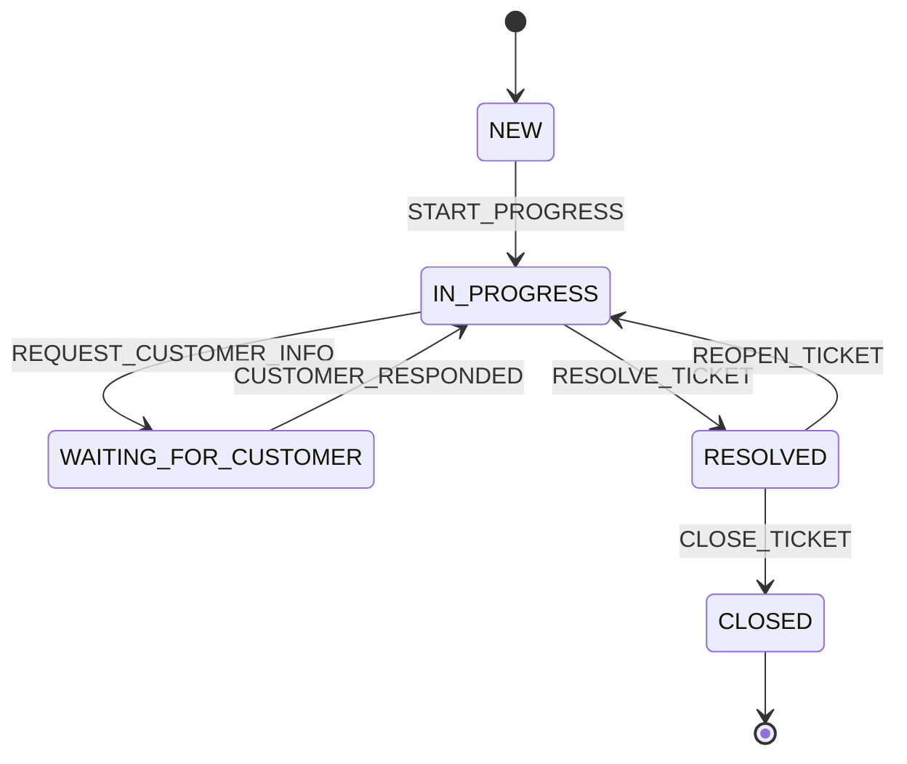

# Ticket Lifecycle BPMN

Issue #34 kapsaminda ticket yasam dongusu `workflow-sla-service` icinde
`ticketLifecycle` BPMN process'i olarak modellendi.

## Statuslar

- `NEW`
- `IN_PROGRESS`
- `WAITING_FOR_CUSTOMER`
- `RESOLVED`
- `CLOSED`

## Izinli Gecisler

| From | To | BPMN signal | Neden |
| --- | --- | --- | --- |
| `NEW` | `IN_PROGRESS` | `START_PROGRESS` | Destek ekibi ticket uzerinde calismaya baslar. |
| `IN_PROGRESS` | `WAITING_FOR_CUSTOMER` | `REQUEST_CUSTOMER_INFO` | Cozum icin musteriden ek bilgi gerekir. |
| `WAITING_FOR_CUSTOMER` | `IN_PROGRESS` | `CUSTOMER_RESPONDED` | Musteri yanitindan sonra destek ekibi calismaya devam eder. |
| `IN_PROGRESS` | `RESOLVED` | `RESOLVE_TICKET` | Destek ekibi cozum uygulandigini belirtir. |
| `RESOLVED` | `CLOSED` | `CLOSE_TICKET` | Cozum kabul edilir ve ticket kapatilir. |
| `RESOLVED` | `IN_PROGRESS` | `REOPEN_TICKET` | Cozum reddedilir veya sorun tekrarlar. |

`CLOSED` terminal status olarak tasarlandi; kapatilan ticket tekrar acilmaz.
Yeni sorun icin yeni ticket olusturulur.

## Uygulama Entegrasyonu

`ticket-service`, status degisikliklerini `TicketWorkflowPort` uzerinden
dogrular. Adapter, bu tablodaki izinli gecisleri ve BPMN signal adlarini kaynak
alir. Gecis izinliyse mevcut `ticket.status-changed` outbox eventi uretilir;
gecis izinli degilse status degismez ve event yazilmaz.

## Mermaid Ozeti

